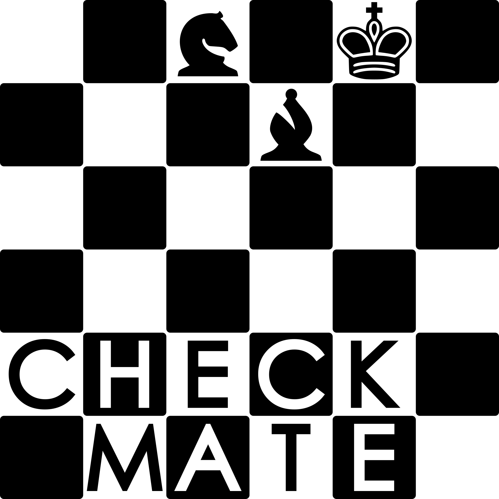

# checkmate

Checkmate is a simple neural network based chess engine written in python. This project is made for learning new skills and for fun.

 

 

## 🛠 How it works

- CNN as a value function to find step win probability.
- Minimax + Beam search to prune that value function.

## 📎 Useful links

- [Sunfish chess engine](https://github.com/thomasahle/sunfish)
- [Deep pink chess engine](https://github.com/erikbern/deep-pink)
